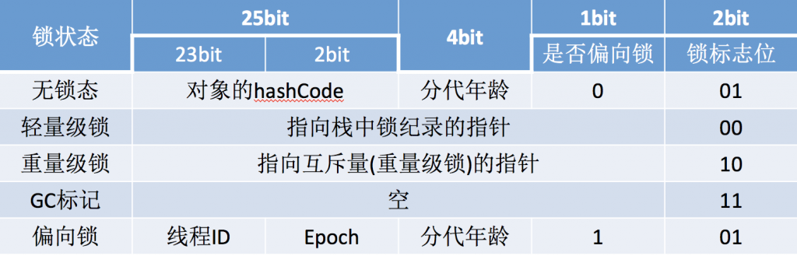

## Java并发实现底层原理
### volatile使用
* volatile字段的作用
>保证所有线程看到的变量值是一致
* 变量值不一致的原因
> 处理器不直接和内存通讯，而是先将系统内存的数据读到内部缓存（L1, L2 或者其他）后进行操作。
* 可见性的实现
> - 被修饰的变量在编译成汇编代码会多一条Lock指令，将缓存的数据写回内存。
> - 对于其他线程来说，每个处理器通过总线嗅探技术来判断缓存数据的有效性
### synchronized的实现
* 具体表现
  - 对于普通的同步方法，锁为实例对象
  - 对于静态同步方法，锁为当前对象的**Class对象**
  - 对于同步方法块，锁是synchronized配置的对象
#### Java对象头
* 对象头        
 
|长度 |内容 | 说明 | 
|:--------:|:--------------:|:--------------:|   
| 32/64 bit| MarkWord | 存储对象的hashCode或者锁信息等|
| 32/64 bit| Class Metadata Address | 存储对象类型数据的指针|
| 32/32 bit| Array length | 数组的长度(普通对象没有这一项) |
* Mark Word    
  
    
(这张图同时解释了为什么新生代GC上限是15)
#### 锁升级
* 偏向锁
  * 获取偏向锁
    - 检查对象头是是否存储了当前线程，没有则用CAS替换Markword
    - 对象头存储了当前线程ID，偏向锁获取成功
  * 撤销偏向锁
    * 暂停拥有偏向锁的线程 
    * 持有偏向锁的线程不处于活跃状态，则释放锁
    * 处于活跃状态，则执行偏向锁线程
* 轻量级锁
  * 获取轻量级锁
    * 在线程的栈桢中创建存储**锁记录**的空间
    * 将对象头中的MarkWord复制到锁记录中（Displaced Mark Word)
    * 利用CAS将对象头中的MarkWord替换为指向锁记录的指针 成功即当前线程获取锁
    * 失败尝试使用自旋来获取锁
  * 解锁
    * 使用CAS操作将Displaced Mark Word替换回对象头
#### 原子操作的实现原理
* 锁总线
* 缓存锁定
* Java实现原子操作
  * 循环CAS实现