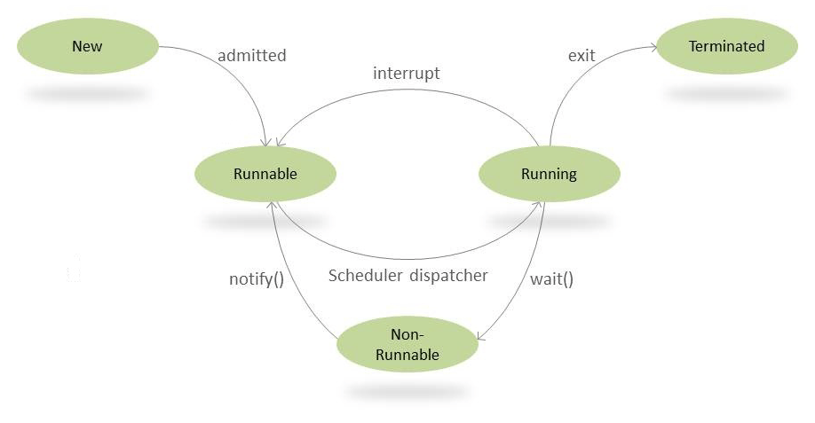

## Java 线程状态变化
> 
## 线程配置
* 优先级
    ```java
    thread.setPriority(int priority);
    ```
* Daemon线程
    ```java
    thread.setDemon(boolean deamon)
    ```
## 线程启动和终止
* 线程的构造
> JDK 线程构造过程，新的线程是由其parent线程来进行空间分配的，新线程的属性在没有显示制定的情况也是继承来parent的(优先级，可继承的threadlocal)


* 线程中断
* 抛出中断错误的程序会在抛出错误之前将中断错误设置为false

## 线程间通信
* volatile 和 synchronized关键字
* 等待和通知机制
  ```java
  //基本范式
  synchronized(Object){
      while(条件不足){
          Object.wait();
      }
      doSomething();
  }
  ```
* 管道输入输出流
  - 以内存为传输介质，进行线程间的通信
* Thread.join()
  - 调用当前线程对象的wait(),线程在结束后会调用自身的notify(); 
* wait()和notify()  
  - [Hollis 源码分析的一篇博客](https://www.hollischuang.com/archives/2030)