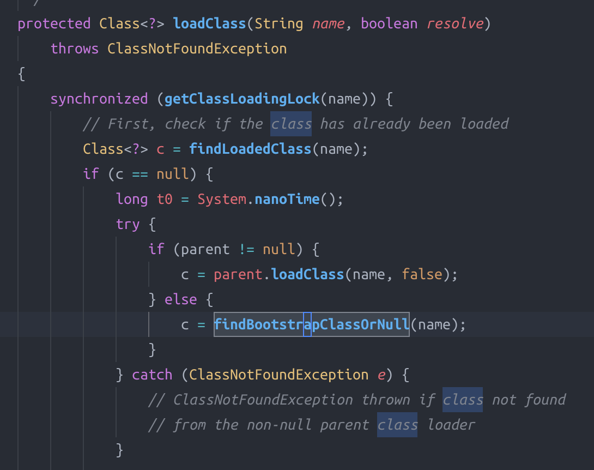

## 类加载的基本机制和过程
### 常见ClassLoader
- Bootstrap ClassLoader
> C++ 实现，<JAVA_HOME>/lib/rt.jar 即常见Java类库(String, ArrayList)
- Extension ClassLoader
> <JAVA_HOME>/lib/ext 加载Java的拓展类
- Application Classloader
> 加载应用程序的类，即所有类路径里的类
### 类加载过程（双亲委派模式）
- 判断该类是否已经加载过，如果已经加载直接放回
- 如果没有加载，先让父ClassLoader加载，加载成功则返回
- 如果父Classloader加载成功，则由当前ClassLoader加载

ClassLoader类的loadclass函数就是这样一个过程
