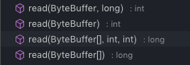
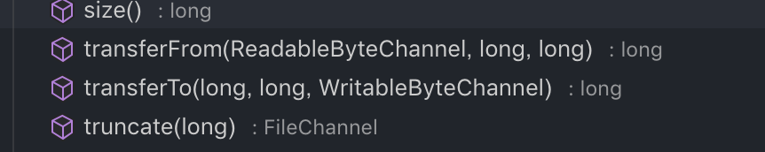
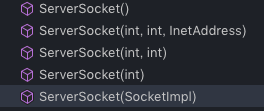

## java.nio.Buffer(abstract)
### 子类(abstract)
* ByteBuffer
* CharBuffer
* ShortBuffer
* IntBuffer
* FloatBuffer
* DoubleBuffer
* LongBuffer
### 使用
* 核心技术点
> * capacity
> * limit 
> * position
> * mark
> * mark < position < limit <= capacity 
### API(以ByteBuffer为例)
* 创建
    ```java
    public static ByteBuffer wrap(byte[] array);
    public static ByteBuffer allocate(int capacity);
    //实际得到的是HeapByteBuffer 
    ```
* 获取基本属性
  ```java
  ByteBuffer put();//支持put 单个元素，数组，buffer
  ByteBuffer get();//同上
  int limit();
  Buffer limit(int newLimit);
  int capacity();
  ByteBuffer mark();
  int position(int position);
  int remaining();//limit - position 
  ByteBuffer reset();//position回到mark处 
  ByteBuffer clear();//从头开始limit = capacity 
  ByteBuffer flip();//清除mark，将limit设为position，position = 0;
  ByteBuffer rewind();//position =0,mark=-1;
  boolean isDirect();//是否设置有中间缓冲区
  ```
### 理解
* ByteBuffer实际底层还是byte数组,只是添加了一些游标使得读取更加便捷,针对一些日常使用的场景用函数实现了封装。(其他的Buffer实际也类似)
* ByteBuffer抽象类生成的ByteBuffer实际是HeapByteBuffer(他的子类)
## channel
### channel (interface)
#### fileChannel
* 方法
    ```java
     int  read(Byte buff);//向buff写入内容
     int write(Byte buff);//向channel写内容
     void close();//关闭通道
     int position();//返回当前位置
     FileChannel position(int pos);//设置位置
     int size();//文件字符数
    ```
    
    
    
* 文件锁
  ```java
    FileChannel lock(long position,long size,boolean shared)
  ```
  - 文件锁定，如果为共享锁则只能读，不可写
  - 独占锁，只有自己能读写
### NetWork
#### NetWorkInterface 
* API
    ```java
    int getMTU();
    String getName();
    byte[] getHardwareAddress();
    Enumeration<InetAddress> getInetAddresses();
    List<InterfaceAddress> getInterfaceAddress();
    ```
#### InetAddress
* API 
    ```java
    InetAddress getByName(String host);//host 可以是主机名，IP地址，域名
    InetAddress getAllByName(String host);
    InetAddress getByAddress(byte[] addr);
    InetAddress getLocalHost();
    String getHostAddress();
    byte[] getAddress();
    String getHostName();//返回主机名
    ```
#### InterfaceAddress
* API 
  ```java
  InetAddress getAddress();

  ```

#### 三者关系
-  
### Socket
* API
    ```java
    public void bind(SocketAddress  bindpoint);//绑定套接字的地址
    public void connect(SocketAddress endpoint);//连接套接字
    public void connect(SocketAddress endpoint,int timeout);
    public int getPort();//获取和该套接字连接的套接字端口；
    public int getLocalPort();//获取自身端口
    public InetAddress getInetAddress();
    public InetAddres getLocalAddress();
    public boolean isClosed();
    public boolean isConnected();
    public void shutdownInput();
    public void shutdownOutput();//对应有isOutputShoudown
    public synchronized void setSendBufferSize(int size);//对应有get
    public void setKeepAlive(boolean on);//对应get
    public void setTrafficClass(int tc);//设置服务质量
    ```
### ServerSocket
* API 
    ```java
    public Socket accept();
    public void setSoTimeout(int timeout);//设定accept 等待时间
    public void bind(SocketAddress endpoint);//绑定Socket地址
    public boolean close();
    public boolean isClosed();
    public boolean isBound();//是否绑定socket地址
    public int getReceiveBufferSize();//获取套接字的缓冲区大小
    public void setReceiveBufferSize(int size);
    ```
    
    构造方法：int port,int backlog(最大连接数默认50)
### InetSocketAddress(实现里SocketAddress 类)
* API
    ```java
    public InetSocketAddress(int port);
    public InetSocketAddress(String hostname,int port);
    public InetSocketAddress(Inetaddress addr,int port);
    ```
### DatagramSocket
* API
* 